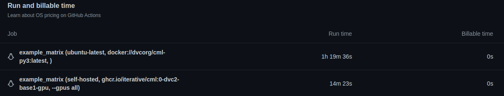

# GitHub Actions with your own GPUs

## Outline
In this example we are doing comparison of MLOps on CPU and GPU using Cirun. When working with Machine Learning Operations ([MLOps](https://ml-ops.org/)), we want continuous delivery and testing of your Model and its operations. MLOps can be automated using **[GitHub Actions](https://docs.github.com/en/actions)** that is a CI/CD platform, and it is way more fast when you use GPUs.
## What are MLOps and it's uses?
MLOps stands for Machine Learning Operations. It establishes a smooth connection from the creation of the ML models to the production. MLOps continues by concentrating on the upkeep and overall monitoring of Machine Learning Engineering. MLOps collaborate on every task carried out by data scientists, DevOps engineers, and ML engineers. MLOps are used to reduce friction with devops and IT, allows better cooperation with data teams, makes ML pipelines reproducible, and speeds up release velocity.

## Why MLOps are better on GPUs?
GPUs are designed to do complex mathematical operations and GPUs have capabilities to process the data on multiple core parallelly.
As ML models uses too many mathematical algorithms and demands to train the different data on same code. So, whenever we do ML operations on GPUs, it will be done effectively and also minimize the computing time complexity.

## How Cirun might help to do this?

[Cirun](https://cirun.io/) allows us to create GPU enabled on our cloud. It minimize the gap between GitHub Actions and automation of self-hosted runners. By using this feature we can automate MLOps on our desired machine.

## Getting Started 
### How to setup MLOps on CPU and GPU using [Cirun](https://docs.cirun.io/reference/yaml#runners-runners).
- In this example we created a workflow for MLOps to be run on GitHub Actions machine having CPU and on Self-hosted runner having GPU.
- For ML operations we have to make ML friendly environment. For this we used **[CML](https://github.com/iterative/cml#getting-started)**, an open-source CLI tool for implementing CI/CD with a focus on MLOps. CML uses custom Docker images that come pre-installed libraries that are essential for MLOps like NodeJS, Python, DVC (Data Version Control).
- To setup **[CML](https://github.com/iterative/cml#getting-started)** environment on CPU use docker container.
```yml
image: "docker://dvcorg/cml-py3:latest"
```
- To setup CML environment on GPU use docker container.
```yml
image: "ghcr.io/iterative/cml:0-dvc2-base1-gpu"
```
- Followed by container argument.
```yml
options: "--gpus all"
```
- This is very important to pass the GITHUB_TOKEN to have a working workflow. So, that authentication is done on behalf of GitHub Actions. You can have look to [GITHUB_TOKEN](https://docs.github.com/en/authentication/keeping-your-account-and-data-secure/creating-a-personal-access-token).

```yml
- name: "MLops"
        env:
          repo_token: "${{ secrets.GITHUB_TOKEN }}"
```
### Machines used for comparison.
#### For MLOps on CPU, we used [GitHub-hosted runners](https://docs.github.com/en/actions/using-github-hosted-runnersabout-github-hosted-runners#supported-runners-and-hardware-resources) which only provides CPUs to work with.
Hardware configuration 
- 2-core CPU (x86_64)
- 7 GB of RAM
- 14 GB of SSD space

#### For MLOps on GPU, we used Self-hosted runners with NVIDIA T4 GPU.
In example we used AWS instance g4dn.xlarge to demonstrate MLOps on GPU.

To configure GPUs using self-hosted runner see [Cirun Configuration](https://docs.cirun.io/reference/yaml#gpu-gpu).

Hardware configuration of instance **g4dn.xlarge**
- NVIDIA T4 GPU
- 4-core CPU (x86_64)
- 16 GB of RAM
- 125 GB of SSD space

## Results

### Comparison results
This example uses an example workflow to compare time complexities on CPU and GPU to do ML operations using [Cirun.io](https://cirun.io/). When this workflow is triggered, it automatically runs a script that creates runner on GitHub Actions and self-hosted runner on AWS with GPU and does ML operations on it.

- **You can see the Time complexity difference in CPU and GPU [here](https://github.com/vishal9629/MLops_with_Cirun/actions/runs/3452191297/usage)**



In this image we can clearly choose between two.
### How Cirun helped us to do this?

Cirun provides us with feature to create On-demand Self-Hosted Github Actions Runners with any configuration on our cloud. We also know that MLOps operates more efficiently on GPUs. Therefore, if we automate the entire process with GPUs is more beneficial.
Using Cirun we created a machine on AWS with NVIDIA T4 GPU and perform our MLOps. As a result we can see the huge difference between complexities of MLOps using CPU and GPU.

## Example workflow

Here we are doing a comparison between MLOps using CPU and GPU. In this workflow we created jobs for two runners, one is for self-hosted using GPU and another one is for GitHub action runner using CPU. we can also reproduce this workflow for single runner by removing one **Runner Configuration** and **Matrix configuration**. To review the latest version of this file in the [GitHub](https://github.com/vishal9629/MLops_with_Cirun/tree/new-example-2/.github/workflows) repository.

##### Also you can directly copy single workflow yml. [MLOps using GPUs yml](https://github.com/vishal9629/MLops_with_Cirun/blob/new-example-2/.github/workflows/MLOps-gpu.yml)


```yml
name: "GitHub Actions with your own GPUs"
on: 
  push:
    branches: [ "none" ] # When a push occurs on a branch workflow will trigger on your desired branch.
  workflow_dispatch: 
jobs:
  CPU_GPU_matrix: # Creating matrix for jobs.
    strategy:
      matrix:
        # Creating a 2d matrix to execute our jobs with respective docker containers.
        os: ["ubuntu-latest", "cirun.gpu"] 
        containers: ["docker://dvcorg/cml-py3:latest" , "ghcr.io/iterative/cml:0-dvc2-base1-gpu" ]
        container_arg: [" " , "--gpus all"]
        # Excluding the unwanted docker container and container_arg in our respective OS.
        exclude:
          - os: "ubuntu-latest"
            containers: "ghcr.io/iterative/cml:0-dvc2-base1-gpu"
          - os: "ubuntu-latest"
            container_arg: "--gpus all"
          - os: "cirun.gpu"
            containers: "docker://dvcorg/cml-py3:latest"
          - os: "cirun.gpu"
            container_arg: " "
    # Workflow to run commands in OS.
    # Dynamic passing of os, containers, container_agr using matrix 
    runs-on: "${{ matrix.os }}" 
    container:
      image: "${{ matrix.containers }}"
      options: "${{ matrix.container_arg }}"
    # Steps that we want to have with OS.
    steps:
      - uses: "actions/checkout@v3"
      - name: "Dependency Install"
        run: "pip install -r requirements.txt"
      - name: "MLops"
        env:
          repo_token: "${{ secrets.GITHUB_TOKEN }}"
        run: |
          # Your ML workflow goes here, you can pass your variable name
          "python train.py"
```

## References
- [GitHub Actions](https://docs.github.com/en/actions)
- [MLOps](https://ml-ops.org/)
- [CML](https://cml.dev/)
- [Example GitHub repository](https://github.com/vishal9629/MLops_with_Cirun/tree/new-example-2)
- [MLOps using GPUs yml](https://github.com/vishal9629/MLops_with_Cirun/blob/new-example-2/.github/workflows/MLOps-gpu.yml)